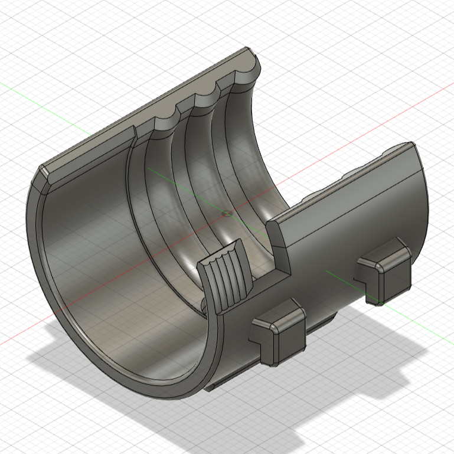
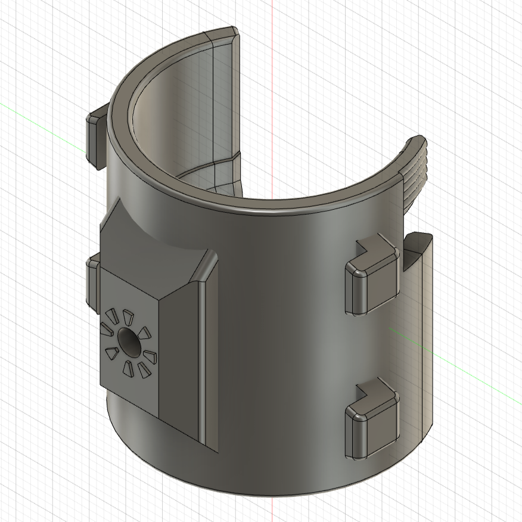
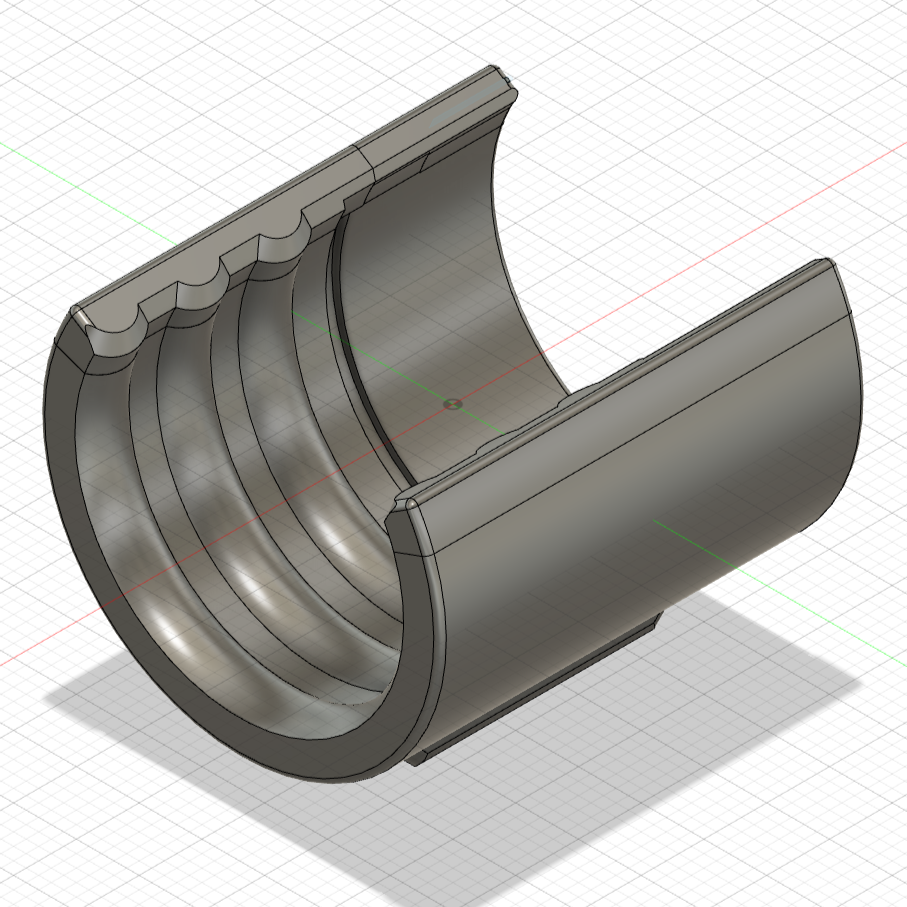
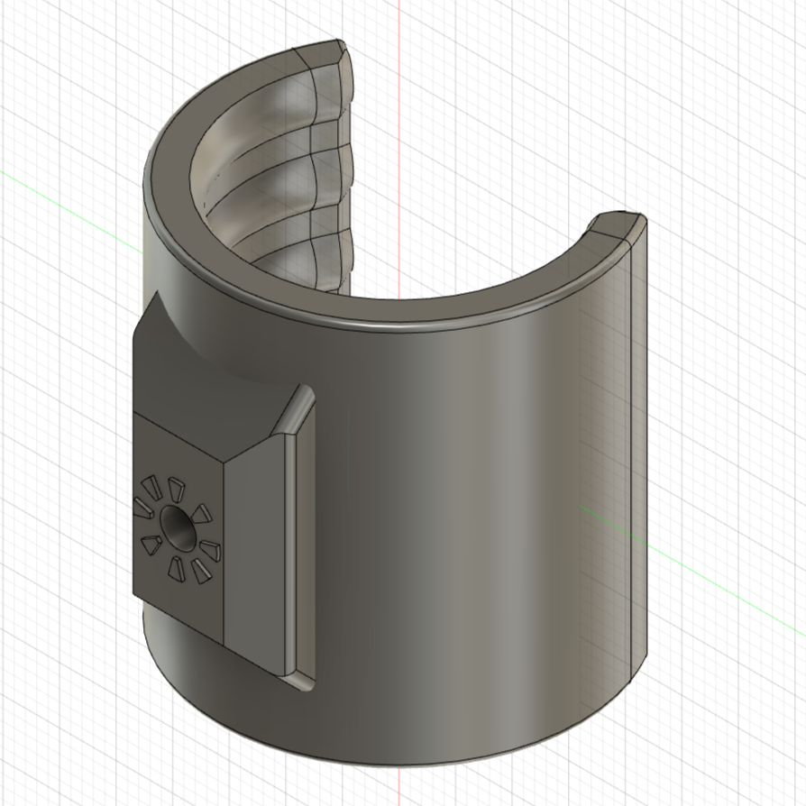
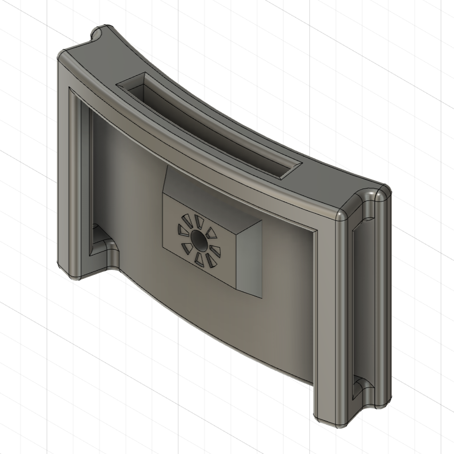
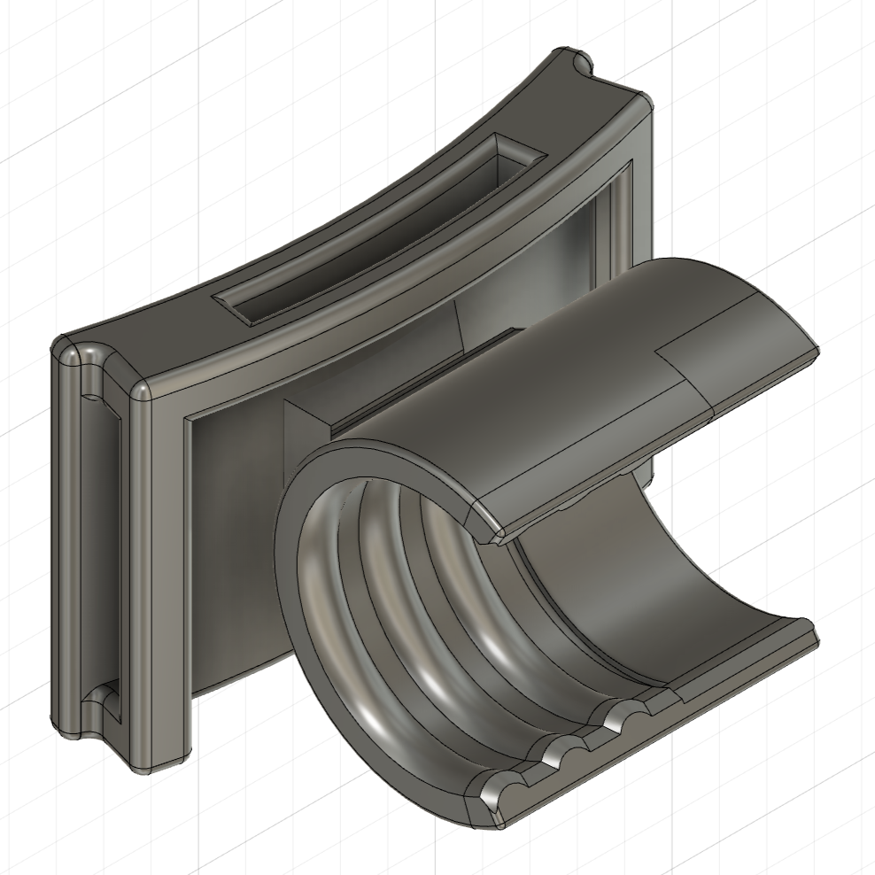
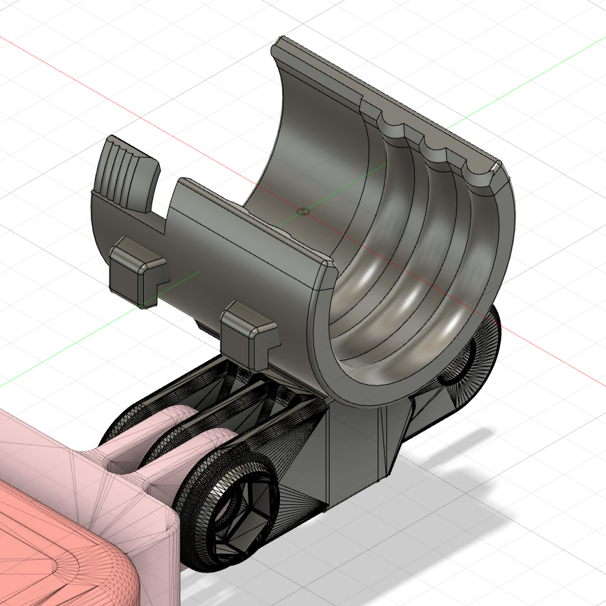

# Wurkkos-HD20-mounts
I didn't like the original head mount of the Wurkkos HD20 flashlight for several reasons (for example, it forced me to remove the metal clip). Therefore, I designed another version of it, as well as a GoPro mount. 

There are two versions of the clip (the part that holds the flashlight): one with a twist-to-lock system and another one without. Both work fine for me, and the flashlight doesn't move or fall off even with strong shakes.

The mounts and clips can be assembled with an M3 screw + nut (with a head diameter of 5.5mm and a max height of 2mm).

## Flashlight clip: twist-to-lock version

  
  

## Flashlight clip: no-lock version

  
  

## Head mount

  
  

## GoPro mount

  

